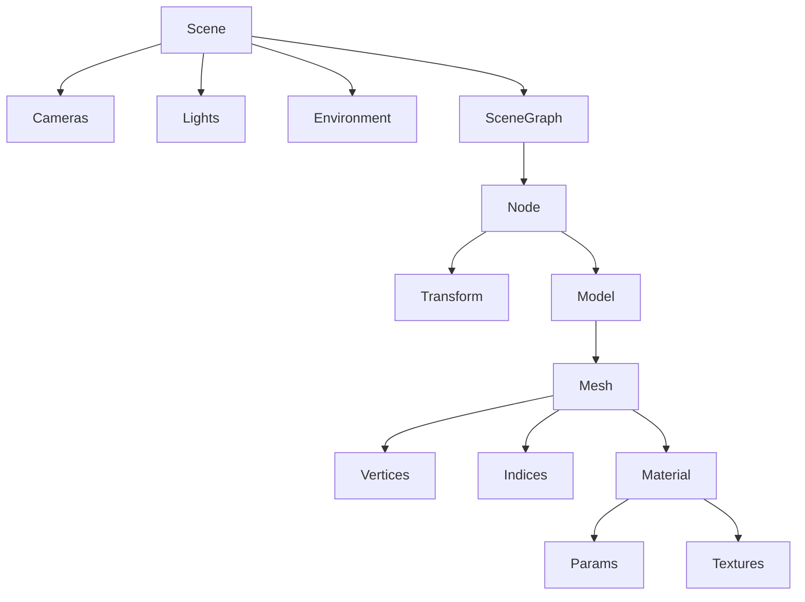

# Состав трёхмерной сцены

Сцена — виртуальное описание мира, из которого графический конвейер строит кадр. Это не картинка и не набор треугольников «на экране», а иерархия данных: кто смотрит, кто светит, что стоит в пространстве, из чего сделана поверхность и какими картами она описана.

---

## 1. Сцена (контейнер)

- **Метаданные**
  - единицы измерения (метры, условные единицы)
  - up-axis (`Y-up` / `Z-up`)
  - фон / clear color
  - цветовое пространство (sRGB на диске, linear в шейдере)
- **Камеры (наблюдатели)**
  - положение и ориентация: `eye`, `center`, `up` (`lookAt`)
  - проекция: perspective / ortho / frustum
  - параметры проекции: fov, aspect, near, far
  - viewport (поле просмотра на устройстве)
  - активная камера кадра (в сцене камер может быть несколько)
- **Источники света (ИС)** — см. §2
- **Окружение**
  - skybox / cubemap
  - environment map (IBL)
  - туман / атмосфера
  - light probes / reflection probes
- **Граф сцены**
  - дерево узлов с локальными трансформами TRS (translate / rotate / scale)
  - мировая матрица узла = произведение матриц предков
  - инстансинг: несколько узлов ссылаются на одну геометрию
- **Объекты** — геометрия в узлах, см. §3
- **Анимация**
  - клипы (каналы: трансляция, вращение, масштаб)
  - скелет / кости
  - morph targets (blend shapes)
- **Глобальные параметры рендера** (настройки сцены, не «объекты»)
  - culling (frustum, back-face, occlusion)
  - shadow maps источников
  - HDR / tone mapping
  - MSAA / постпроцесс

---

## 2. Источники света (ИС)

ИС — любой объект, излучающий энергию. В эмпирических моделях (Фонг, Блинн–Фонг) интенсивность \(I\) безразмерна; физически ей соответствует энергетическая яркость \(L\) (radiance).

### Типы

- **Фоновый (ambient)**
  - не зависит от позиции точки и направления взгляда
  - обычно один на сцену: \(k_a I_a\)
- **Направленный (directional)**
  - параллельные лучи, нет позиции, есть направление
  - имитация солнца
  - нет радиального затухания
- **Точечный (point)**
  - позиция в пространстве, светит во все стороны
  - радиальное затухание: \(1/(a+d)\) или inverse-square \(1/d^2\)
- **Прожектор / спот (spot)**
  - частный случай точечного, ограничен конусом
  - inner / outer angle
  - угловое затухание \(\cos^\alpha\theta\)
- **Площадный (area) / emissive-поверхности**
  - конечный размер, мягкие тени
  - нужен для GI / path tracing
- **IBL / environment lighting**
  - освещение из карты окружения (irradiance + prefiltered specular)

### Общие параметры ИС

- цвет (RGB, независимо по каналам)
- интенсивность \(I_0\) (или radiance / luminous flux в физической модели)
- attenuation (радиальное и/или угловое)
- маска слоёв / какие объекты освещает
- **shadow map** — текстура *сцены* (глубина из вида ИС), не карта материала

Суммарное освещение в модели Фонга:

\[
I = k_e + k_a I_a + \sum_j I_j
\]

---

## 3. Объекты сцены

Узел графа может ссылаться на геометрию одного из представлений:

- **полигональные модели** — основной путь курса и realtime-конвейера
- **кривые / поверхности** (сплайны, NURBS) → тесселяция в полигоны
- **воксели**
- **Gaussian Splatting**
- **частицы / билборды**
- **импосторы** (подмена сложной геометрии спрайтом)

Для полигонального объекта в узле:

- ссылка на модель (или на конкретный меш)
- мировая трансформация (из графа)
- видимость / слой
- LOD (набор мешей разной детализации)
- bounding volume (AABB, сфера) для culling

---

## 4. Полигональная модель

Модель — набор мешей + материалы + иерархия, а не один «мешок треугольников».

- иерархия узлов (`aiNode`): какие меши принадлежат какому узлу, локальный трансформ
- набор **мешей** (подсети с разными материалами)
- набор **материалов** (шарятся: несколько мешей → один материал)
- скелет / кости (skinning)
- morph targets
- текстуры: внешние файлы (PNG и т.п.) или встроенные в контейнер

---

## 5. Меш

Меш — атомарная порция геометрии с одним материалом и одним набором буферов.

- **Вершины** (атрибуты на вершину)
  - `Position` — локальные координаты
  - `Normal` — нормаль для освещения
  - `TexCoords` (UV) — координаты в пространстве текстуры; наборов UV может быть несколько
  - `Tangent`, `Bitangent` — базис для normal mapping
  - `Color` — вершинный цвет (опционально)
  - `BoneIDs`, `Weights` — влияние костей (обычно до 4 на вершину)
- **Индексы / грани**
  - список треугольников (после триангуляции)
  - грань = тройка индексов в массив вершин
- **Топология:** triangle list / strip / fan
- **Индекс материала** → материал модели
- **GPU-представление:** VAO + VBO (атрибуты) + EBO (индексы)

---

## 6. Материал

Материал задаёт, *как* поверхность отвечает на свет. Геометрия без материала — только форма.

### Состояние рендера

- шейдер / программа (Phong, Blinn–Phong, PBR, unlit, …)
- blending, alpha-test
- culling (односторонний / двусторонний, `doubleSided`)
- `alphaMode`: opaque / mask / blend

### Эмпирический (Фонг / Блинн–Фонг)

- \(k_a, k_d, k_s\) — фоновый, диффузный, зеркальный коэффициенты
- shininess \(\alpha\) (блеск)
- emissive \(k_e\)
- opacity
- карты: diffuse, specular, normal, height

### PBR

Два распространённых набора параметров:

- **Metallic-Roughness:** albedo (base color), metallic, roughness
- **Specular-Glossiness:** diffuse, specular, glossiness

Дополнительно:

- IOR / Fresnel
- occlusion
- emissive
- height / displacement
- environment / reflection

BRDF описывает, какая доля падающего света отражается в направлении взгляда.

---

## 7. Текстуры

Текстура — дискретное поле (обычно 2D-изображение), сэмплируемое по UV. Элемент — **тексел (texel)**.

Нужно разделять: *что хранит карта* и *как она читается*.

### Типы карт (привязка к материалу)

- albedo / diffuse — базовый цвет без освещения
- specular / metallic
- roughness / glossiness
- normal — возмущение нормали (tangent space)
- height / displacement / bump — рельеф
- AO (ambient occlusion)
- emissive
- opacity / alpha
- environment / reflection (cubemap, sphere map)
- lightmap — запечённое освещение
- blend — смешивание нескольких диффузных карт (ландшафт)
- microfacet — распределение микрограней (редко как отдельная карта)

**Shadow map** принадлежит источнику света / проходу теней, не мешу.

### Ресурс текстуры

- изображение (PNG, JPEG, EXR, встроенный буфер)
- mipmap (цепочка разрешений)
- процедурная генерация (шум Перлина и т.п.) vs запечённая с high-poly
- **sampler**
  - wrap: repeat / clamp / mirror
  - фильтр: nearest / bilinear / trilinear
  - анизотропная фильтрация
- индекс UV-набора (какой `TexCoords` использовать)

### Texture mapping vs sampling

- **mapping** — соответствие 3D-поверхности ↔ UV (задаётся на вершинах, интерполируется)
- **sampling** — чтение текселя в фрагментном шейдере по интерполированным UV

---

## 8. Соответствия форматам и GPU

### Assimp `aiScene`

| Поле | Содержание |
|---|---|
| `mRootNode` | корень графа, дочерние `aiNode`, локальные матрицы, индексы мешей |
| `mMeshes[]` | вершины, нормали, UV, касательные, грани, `mMaterialIndex`, кости |
| `mMaterials[]` | параметры + слоты текстур (`aiTextureType_DIFFUSE`, `SPECULAR`, `NORMALS`, `HEIGHT`, …) |
| `mTextures[]` | встроенные изображения |
| `mLights[]` | ИС из файла (если экспортированы) |
| `mCameras[]` | камеры |
| `mAnimations[]` | клипы, каналы костей / узлов |

Узел хранит *индексы*, данные лежат в массивах сцены.

### glTF

- `scenes` → `nodes` (TRS, дети)
- узел → `mesh` и/или `camera` и/или свет (`KHR_lights_punctual`) и/или `skin`
- `mesh.primitives`: атрибуты (`POSITION`, `NORMAL`, `TANGENT`, `TEXCOORD_n`, `JOINTS`, `WEIGHTS`), `indices`, `material`
- `materials.pbrMetallicRoughness` + `normalTexture` / `occlusionTexture` / `emissiveTexture`
- `textures` = `image` + `sampler`
- бинарные данные: `accessors` → `bufferViews` → `buffers` (`.bin`)

### GPU (конвейер L2)

После загрузки сцена становится набором GPU-ресурсов:

- VBO — атрибуты вершин
- EBO — индексы
- VAO — раскладка атрибутов
- текстурные объекты + sampler state
- shader program
- uniform-ы кадра: MVP / view / projection, параметры камеры, массив ИС, привязки карт материала

Конвейер не «рисует сцену целиком»: для каждого меша выставляются материал и трансформ узла, затем `draw`.
